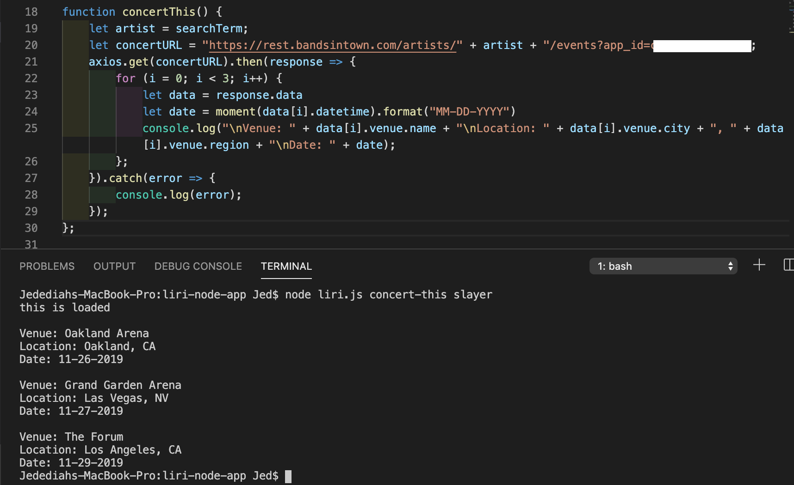
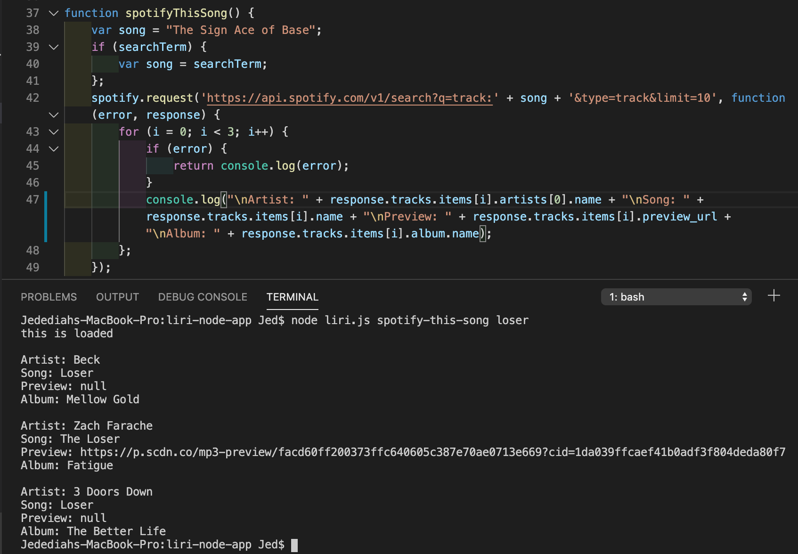
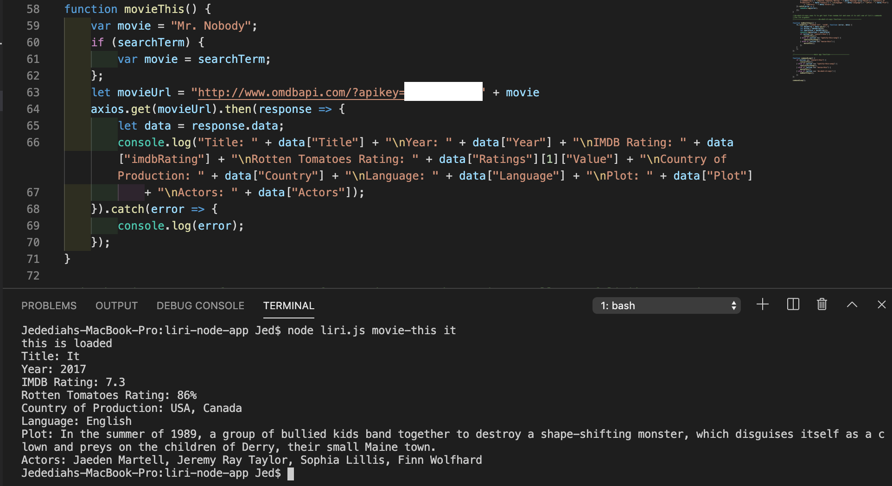
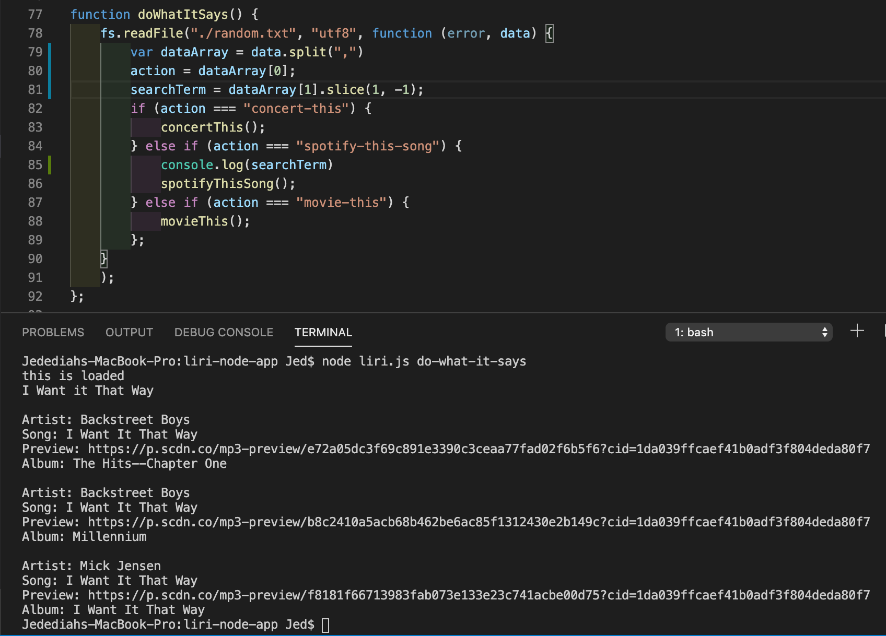

# liri-node-app

Liri is a command line app that takes in search terms and returns results from various APIs. Liri has four main functions: concert-this, movie-this, spotify-this-song, and do-what-it-says. This is a node app, so the user begins by typing the following into the command line: `node liri.js` followed by two arguments. The first tells Liri which function to use and the second is the search term. Here's a description of each function and what they do:

**concert-this**

The concert-this function takes in the name of a band or artist and returns information about the venue, location, and date of thier next three sheduled shows. In the command line, the user types:

`node liri.js concert-this artist/band`

The app then queries the Bands in Town API with the search term and returns the results:

**spotify-this-song**

The spotify-this-song function takes in the name of a song and returns information about the top three matches, includinh song, artist, album, and a link to a preview of the song, if available. If no song name is entered, the default search term is The Sign by Ace of Base. In the command line, the user types:

`node liri.js spotify-this-song name`

The app then queries the Spotify API with the search term and returns the results:

**movie-this**

The movie-this function takes in the name of a movie and returns information about the movie including the title, year of production, IMDB rating, Rotten Tomatoes rating, country of production, language, a plot synopsis and the names of the main actors in the movie. If no movie is entered, the default search term is Mr. Nobody. In the command line, the user types: 

`node liri.js movie-this movie name`

The app then queries the OMDB API with the search term and returns the results:

**do-what-it-says**

The do-what-it-says function uses the fs node module to query the type of search and the search term from a seperate .txt file. In the command line, the user types:  

`node liri.js do-what-it-says`

The app then runs the appropriate function and returns the results.

